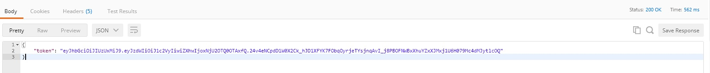
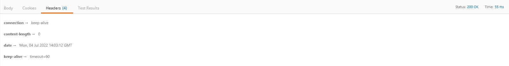
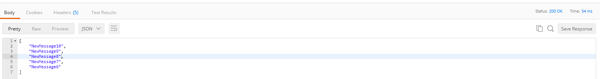

# Инсайд. Тестовое задание
 
## Настройка
- Внести в ***build.gradle*** зависимость для драйвера использумеой БД, если в качестве таковой не используется HSQLDb
- Для задания параметров запуска приложения используются ресурсы в директории ***./src/main/resources/***.
 Там представлены два файла параметров приложения ***application.properties*** и ***application-dev.properties*** для общего и ***dev*** профилей соответсвтенно

### Параметры
1. В файле ***application.properties*** представлены данные **spring.datasource.**, **spring.jpa.** для подключение к локальному серверу БД. А также порт **server.port**, на котором будет запущено приложение и параметр **jwt.secret**, необходимый для генерации токена 
2. В файле ***application-dev.properties*** представлены данные для ***dev*** профиля для подключения к in-memory БД.  

---
## Запуск
- При изначальных параметрах, приложение запускается и принимает запросы по адресу: http://localhost:8092/
- При описании изображения контейнера ***Dockerfile***, в качестве параметра запуска приложения для удобства  указывается *****dev*** профиль. При запуске контейнера использовался 8091 порт для контейнера.

** При использовании dev профиля в БД инициализируется начальные данные, описанные в бине *com.example.insidetesttask.DevProfileDataLoader*. По умолчанию: name: user, password: password
 
### Api
В приложении установлены три эндпоинта для генерации токена, сохранения сообщения и получения списка сообщений пользователя

|url|Method|Auth. header|Body(.json)|Description
| -----|------|------|------|------|
|/auth|POST|false|name, password|Производит аутентификацию пользователя и Возвращает .json файл с новым токеном, в качестве subject использутеся имя пользователя
|/message|POST|true|name, message|Производит чтение и проверку переданного токена и Сохраняет сохраняет сообщение в БД
|/messages|POST|true|name, message|Производит чтение и проверку переданного токена и Возвращает .json файл с указанным количеством последних сообщений. Шаблон сообщения: history 10

---
## Тест
При запросе:

1. localhost:8092/auth
	- POST /auth HTTP/1.1
	- Host: localhost:8092
	- Content-Type: application/json
	-
	- {
	- "name": "user",
	- "password": "password"
	- }

2. localhost:8092/message
	- POST /msg HTTP/1.1
	- Host: localhost:8092
	- Authorization: Bearer_eyJhbGciOiJIUzUxMiJ9.eyJzdWIiOiJ1c2VyIiwiZXhwIjoxNjU2OTM0NjgzfQ.YIfZtPAtBny-m6uPI-HXUR9uNUWb-wGFOu7ivCo5G4IjWIPd99yjMu5ljlAcZWb7aAY5nHuiyJxkndeBWiICEw
	- Content-Type: application/json
	-
	- {
	- "name": "user",
	- "message" : "NewMessage" 
	- }

3. localhost:8092/messages
	- POST /messages HTTP/1.1
	- Host: localhost:8092
	- Authorization: Bearer_eyJhbGciOiJIUzUxMiJ9.eyJzdWIiOiJ1c2VyIiwiZXhwIjoxNjU2OTQzOTgxfQ.j7oHF49Bfe2t89atjoYlN2-xz6arLkQtrtS9JIktz58pKqqCWkghXCqW8_HrzT4_t2yOQ-peGUHLvkVkUk2Vfg
	- Content-Type: application/json
	- 
	- {
	- "name": "user",
	- "message" : "history 5"	
	- }	

